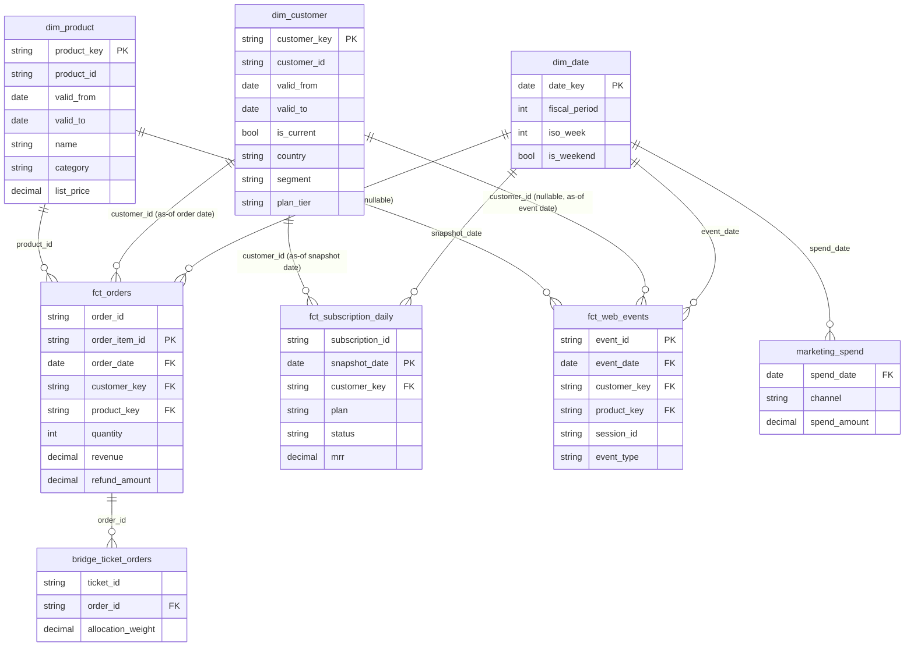

# Data model: business questions, bus matrix, grain

Written before any dbt model exists, per the Kimball process this project follows: start from business
processes and their grain, not from whatever tables the source happens to have.

## 1. Business questions → metrics → dimensions

| # | Question | Metric(s) | Dimensions to slice by | Source fact |
|---|---|---|---|---|
| 1 | What is MRR, by plan and by cohort, at the end of each month? | `mrr` (semi-additive) | `date` (month-end), `plan`, `customer` (signup cohort) | `fct_subscription_daily` |
| 2 | How much of this month's revenue growth is new, expansion, contraction, or churn? | `mrr_new`, `mrr_expansion`, `mrr_contraction`, `mrr_churn` (each additive within a period, derived as a period-over-period bridge) | `date` (month), `plan` | `fct_subscription_daily` |
| 3 | What is net revenue retention of each signup cohort at 3, 6, 12 months? | `net_revenue_retention` (non-additive ratio: cohort MRR at month N ÷ cohort MRR at month 0) | `customer` (signup cohort), `date` (months since signup) | `fct_subscription_daily` |
| 4 | What is blended and per-channel CAC, and how does it trend? | `cac` (non-additive ratio: spend ÷ new customers) | `channel`, `date` | `marketing_spend` + new-customer counts from `dim_customer` |
| 5 | Which products drive first orders, and which drive repeat orders? | `order_count`, `revenue` (additive), sliced by order sequence number | `product`, `customer`, `date` | `fct_orders` |
| 6 | What is the refund rate by product and by month, and is it moving abnormally? | `refund_rate` (non-additive ratio: refund amount ÷ order amount) | `product`, `date` | `fct_orders` (refund amount allocated to line grain — see §3) |
| 7 | What is the conversion rate `checkout_started` → `checkout_completed`, by device and channel? | `conversion_rate` (non-additive ratio) | `channel`, `date`, device *(gap — see §5)* | `fct_web_events` |
| 8 | Which active customers show early churn signals, and can operations act on that list today? | derived signal, not a stored measure (built from subscription state + behavioral recency, not summed) | `customer` | `fct_subscription_daily` + `fct_web_events` (feeds a mart, not a new fact) |

Question 8 is deliberately not traced to a single fact table: it's a customer-level segment computed by
combining subscription state and event recency, materialized as a mart for reverse ETL rather than
aggregated like the others.

## 2. Bus matrix

Rows are business processes; columns are the conformed dimensions declared in `docs/adr/0002-conformed-dimensions.md`.
`X` means the process's fact table carries that dimension as a foreign key (or, for `channel`, will once
the gap in §5 is closed).

| Business process | `date` | `customer` | `product` | `channel` | `plan` |
|---|---|---|---|---|---|
| Orders | X | X | X | (gap) | | 
| Subscriptions | X | X | | | X |
| Web sessions | X | X (nullable) | X | (gap) | |
| Marketing spend | X | | | X | |
| Support | X | X | | | |

`plan` and `channel` are each used by exactly one process today. They're still declared as conformed
dimensions (not embedded attributes) because `AE-17`/`AE-18` plan to report plan-level and channel-level
metrics across processes later (e.g. CAC per channel compared against orders attributed to that channel) —
conforming them now avoids a rename later. `product` is not applicable to subscriptions (a subscription is
sold against a `plan`, not a product SKU) or marketing spend (spend is booked at channel/day grain, not
per product).

## 3. Fact tables: declared grain

Written before implementation, per `AE-03`'s acceptance criteria — no fact table below exists yet.

- **`fct_orders`** — one row per order line item (`order_id` + `order_item_id`). Refunds are allocated back
  to the order line pro-rata by line revenue share, since the source `refunds` table only references
  `payment_id`, not a specific order line. This allocation is a modeling *choice*, not a fact the source
  provides — documented here so it isn't mistaken for a precise refund-to-line-item mapping.
- **`fct_subscription_daily`** — one row per active subscription per calendar day (periodic snapshot).
  Daily, not monthly, grain so month-end MRR (question 1) and the new/expansion/contraction/churn bridge
  (question 2) can both be derived from the same table without a second fact.
- **`fct_web_events`** — one row per raw event (`event_id`), unchanged grain from the source. No
  aggregation at ingestion; funnel and session-level metrics are computed downstream.

No fact table is declared for support tickets or marketing spend: `support` becomes a bridge to orders
(`AE-15`, many-to-many — a ticket can reference several orders), and `marketing_spend` is staged directly
at its native day × channel grain and used as-is (it's dimension-shaped, not something with a further
grain to declare).

## 4. Measure additivity

| Measure | Fact | Additivity | Reason |
|---|---|---|---|
| `revenue` (`quantity × unit_price`) | `fct_orders` | Additive | Sums correctly across every dimension, including time. |
| `quantity` | `fct_orders` | Additive | Same. |
| `refund_amount` | `fct_orders` | Additive | Same reasoning as revenue, once allocated to line grain. |
| `mrr` | `fct_subscription_daily` | **Semi-additive** | Summable across `customer`/`plan` at a fixed point in time, but summing across `date` overcounts a subscription that was active all month — the classic snapshot-fact trap this project exists to demonstrate. Must aggregate with last-value-in-period, never `SUM`. |
| `event_count` (one row per event) | `fct_web_events` | Additive | Row count, sums cleanly across any dimension. |
| `spend_amount` | `marketing_spend` | Additive | Sums correctly across `channel` and `date`. |
| `net_revenue_retention` | derived from `fct_subscription_daily` | **Non-additive** | A ratio of two MRR snapshots (cohort MRR at month N ÷ month 0). Computing it for a combined period by summing the ratio across sub-periods is meaningless; it must be recomputed from the underlying MRR values at the target grain. |
| `refund_rate` | derived from `fct_orders` | **Non-additive** | Ratio of two additive measures (`refund_amount` ÷ `revenue`); correct at any grain only if computed from the pre-aggregated sums, never averaged across rows. |
| `cac` | derived from `marketing_spend` + `dim_customer` | **Non-additive** | Ratio of spend to a customer count; blended CAC is not the average of per-channel CAC. |
| `conversion_rate` | derived from `fct_web_events` | **Non-additive** | Ratio of two event counts; same rule as `refund_rate`. |

## 5. ERD

## 6. Known gaps carried from `AE-02`

The generator (`AE-02`) doesn't currently emit an acquisition/attribution channel on `customers`, `orders`,
or `web_events`, and doesn't emit a device on `web_events`. Business questions 4 and 7 need both. This is
flagged here rather than silently designed around, because the bus matrix and grain declarations above are
written as the *target* design — closing this gap is a prerequisite for `AE-17`'s `marketing_spend`
semantic model and for `fct_web_events` fully answering question 7, and should be picked up as a small
follow-up to the generator before those issues land.
