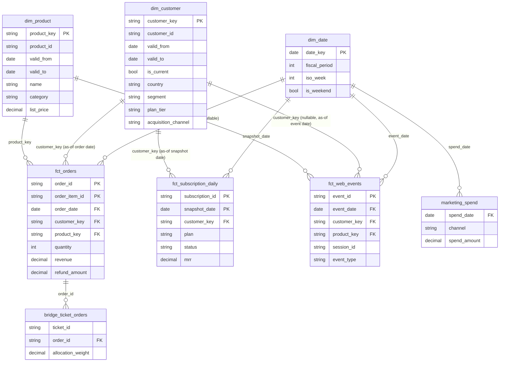

# Data model: business questions, bus matrix, grain

Written before any dbt model exists, per the Kimball process this project follows: start from business
processes and their grain, not from whatever tables the source happens to have.

## 1. Business questions → metrics → dimensions

| # | Question | Metric(s) | Dimensions to slice by | Source fact |
|---|---|---|---|---|
| 1 | What is MRR, by plan and by cohort, at the end of each month? | `mrr` (semi-additive) | `date` (month-end), `plan`, `customer` (signup cohort) | `fct_subscription_daily` |
| 2 | How much of this month's revenue growth is new, expansion, contraction, or churn? | `mrr_new`, `mrr_expansion`, `mrr_contraction`, `mrr_churn` (each additive within a period, derived as a period-over-period bridge) | `date` (month), `plan` | `fct_subscription_daily` |
| 3 | What is net revenue retention of each signup cohort at 3, 6, 12 months? | `net_revenue_retention` (non-additive ratio: cohort MRR at month N ÷ cohort MRR at month 0) | `customer` (signup cohort), `date` (months since signup) | `fct_subscription_daily` |
| 4 | What is blended and per-channel CAC, and how does it trend? | `cac` (non-additive ratio: spend ÷ new customers) | `channel`, `date` | `marketing_spend` + new-customer counts from `dim_customer` |
| 5 | Which products drive first orders, and which drive repeat orders? | `order_count`, `revenue` (additive), sliced by order sequence number | `product`, `customer`, `date` | `fct_orders` |
| 6 | What is the refund rate by product and by month, and is it moving abnormally? | `refund_rate` (non-additive ratio: refund amount ÷ order amount) | `product`, `date` | `fct_orders` (refund amount allocated to line grain — see §3) |
| 7 | What is the conversion rate `checkout_started` → `checkout_completed`, by device and channel? | `conversion_rate` (non-additive ratio) | `channel`, `device`, `date` | `fct_web_events` |
| 8 | Which active customers show early churn signals, and can operations act on that list today? | derived signal, not a stored measure (built from subscription state + behavioral recency, not summed) | `customer` | `fct_subscription_daily` + `fct_web_events` (feeds a mart, not a new fact) |

Question 8 is deliberately not traced to a single fact table: it's a customer-level segment computed by
combining subscription state and event recency, materialized as a mart for reverse ETL rather than
aggregated like the others.

## 2. Bus matrix

Rows are business processes; columns are the conformed dimensions declared in `docs/adr/0002-conformed-dimensions.md`.
`X` means the process's fact table carries that dimension as a foreign key; `X*` means it's resolved by
joining to `dim_customer` rather than stored directly on the fact.

| Business process | `date` | `customer` | `product` | `channel` | `plan` |
|---|---|---|---|---|---|
| Orders | X | X | X | X* | |
| Subscriptions | X | X | | | X |
| Web sessions | X | X (nullable) | X | X | |
| Marketing spend | X | | | X | |
| Support | X | X | | | |

`channel` now has three real consumers — `marketing_spend`, `web_events` (as of the customer/event's own
channel attribution), and `orders` (as of the ordering customer's *acquisition* channel, joined through
`dim_customer` rather than stored redundantly on `fct_orders`). All three source their values from the
same `config.CHANNELS` list in the generator, so the dimension can't drift between sources before it's
even built. `plan` is still used by exactly one process (`subscriptions`); it stays conformed rather than
embedded because `AE-17`/`AE-18` plan to report plan-level metrics across processes later, and `product` is
not applicable to subscriptions (sold against a `plan`, not a SKU) or marketing spend (booked at
channel/day grain, not per product).

## 3. Fact tables: declared grain

Written before implementation, per `AE-03`'s acceptance criteria — no fact table below exists yet.

- **`fct_orders`** — one row per order line item, grain key **`(order_id, order_item_id)`** — a composite
  key, not `order_item_id` alone. The generator's `order_item_id` happens to be globally unique (it's built
  from a running counter across all orders), but that's an accident of how the generator constructs the
  string, not a guarantee a real source would make; a real line-item ID is typically order-scoped (`item 1`,
  `item 2`, ...). The uniqueness test in `AE-12` should enforce the composite key so the model stays correct
  if that generator detail ever changes. Refunds are allocated back to the order line pro-rata by line
  revenue share, since the source `refunds` table only references `payment_id`, not a specific order line —
  a modeling *choice*, not a fact the source provides.
- **`fct_subscription_daily`** — one row per active subscription per calendar day (periodic snapshot),
  grain key **`(subscription_id, snapshot_date)`**. Daily, not monthly, grain so month-end MRR (question 1)
  and the new/expansion/contraction/churn bridge (question 2) can both be derived from the same table
  without a second fact.
- **`fct_web_events`** — one row per raw event (`event_id`), unchanged grain from the source. No
  aggregation at ingestion; funnel and session-level metrics are computed downstream.

No fact table is declared for support tickets or marketing spend: `support` becomes a bridge to orders
(`AE-15`, many-to-many — a ticket can reference several orders), and `marketing_spend` is staged directly
at its native day × channel grain and used as-is (it's dimension-shaped, not something with a further
grain to declare).

## 4. Measure additivity

| Measure | Fact | Additivity | Reason |
|---|---|---|---|
| `revenue` (`quantity × unit_price`) | `fct_orders` | Additive | Sums correctly across every dimension, including time. |
| `quantity` | `fct_orders` | Additive | Same. |
| `refund_amount` | `fct_orders` | Additive | Same reasoning as revenue, once allocated to line grain. |
| `mrr` | `fct_subscription_daily` | **Semi-additive** | Summable across `customer`/`plan` at a fixed point in time, but summing across `date` overcounts a subscription that was active all month — the classic snapshot-fact trap this project exists to demonstrate. Must aggregate with last-value-in-period, never `SUM`. |
| `event_count` (one row per event) | `fct_web_events` | Additive | Row count, sums cleanly across any dimension. |
| `spend_amount` | `marketing_spend` | Additive | Sums correctly across `channel` and `date`. |
| `net_revenue_retention` | derived from `fct_subscription_daily` | **Non-additive** | A ratio of two MRR snapshots (cohort MRR at month N ÷ month 0). Computing it for a combined period by summing the ratio across sub-periods is meaningless; it must be recomputed from the underlying MRR values at the target grain. |
| `refund_rate` | derived from `fct_orders` | **Non-additive** | Ratio of two additive measures (`refund_amount` ÷ `revenue`); correct at any grain only if computed from the pre-aggregated sums, never averaged across rows. |
| `cac` | derived from `marketing_spend` + `dim_customer` | **Non-additive** | Ratio of spend to a customer count; blended CAC is not the average of per-channel CAC. |
| `conversion_rate` | derived from `fct_web_events` | **Non-additive** | Ratio of two event counts; same rule as `refund_rate`. |

## 5. ERD

```mermaid
erDiagram
    dim_date ||--o{ fct_orders : "order_date"
    dim_customer ||--o{ fct_orders : "customer_key (as-of order date)"
    dim_product ||--o{ fct_orders : "product_key"

    dim_date ||--o{ fct_subscription_daily : "snapshot_date"
    dim_customer ||--o{ fct_subscription_daily : "customer_key (as-of snapshot date)"

    dim_date ||--o{ fct_web_events : "event_date"
    dim_customer ||--o{ fct_web_events : "customer_key (nullable, as-of event date)"
    dim_product ||--o{ fct_web_events : "product_key (nullable)"

    dim_date ||--o{ marketing_spend : "spend_date"

    fct_orders ||--o{ bridge_ticket_orders : "order_id"

    dim_date {
        date date_key PK
        int fiscal_period
        int iso_week
        bool is_weekend
    }
    dim_customer {
        string customer_key PK
        string customer_id
        date valid_from
        date valid_to
        bool is_current
        string country
        string segment
        string plan_tier
        string acquisition_channel
    }
    dim_product {
        string product_key PK
        string product_id
        date valid_from
        date valid_to
        string name
        string category
        decimal list_price
    }
    fct_orders {
        string order_id PK
        string order_item_id PK
        date order_date FK
        string customer_key FK
        string product_key FK
        int quantity
        decimal revenue
        decimal refund_amount
    }
    fct_subscription_daily {
        string subscription_id PK
        date snapshot_date PK
        string customer_key FK
        string plan
        string status
        decimal mrr
    }
    fct_web_events {
        string event_id PK
        date event_date FK
        string customer_key FK
        string product_key FK
        string session_id
        string event_type
    }
    marketing_spend {
        date spend_date FK
        string channel
        decimal spend_amount
    }
    bridge_ticket_orders {
        string ticket_id
        string order_id FK
        decimal allocation_weight
    }
```

`dim_customer.plan_tier` and `fct_subscription_daily.plan` are deliberately two different concepts, not a
duplicated dimension: `plan_tier` is a customer-level segmentation attribute (`free`, `starter`, `growth`,
`enterprise` — a customer has one even with no active subscription), while `plan` is the specific paid plan
a given subscription is billed under as of that snapshot day (`starter`, `growth`, `enterprise` only — no
`free` subscription exists). The generator currently assigns them independently, so in practice they can
disagree for a given customer (e.g. `plan_tier = free` while an active subscription bills `growth`) — this
mirrors a real SaaS platform where account-level tier and billing plan drift out of sync, and is left as-is
rather than artificially forced to agree.

## 6. Implementation notes for later issues

Two things this design gets right on paper but that are easy to get wrong once real dbt code is written —
flagged here so `AE-10`/`AE-12`/`AE-13`/`AE-14` don't have to rediscover them:

- **SCD2 joins must use the as-of range, not the surrogate key alone.** `fct_orders` and
  `fct_subscription_daily` join `dim_customer`/`dim_product` on `order_date BETWEEN valid_from AND
  valid_to` (or the fact's own date), never on `customer_id` alone — a plain equi-join on the natural key
  returns every historical version and silently fans out the fact.
- **`fct_web_events.customer_key` is nullable by design** (anonymous visitors). Any downstream model that
  joins `fct_web_events` to `dim_customer` must use a `LEFT JOIN`; an `INNER JOIN` would silently drop
  every anonymous event, which is roughly 30% of event volume in the generated data — a large enough loss
  to visibly skew funnel metrics without erroring.

## 7. Generator gap: closed

This design surfaced a real gap: the generator (`AE-02`) didn't originally emit an acquisition channel on
`customers`, or a channel/device on `web_events`, which questions 4 and 7 both need. Rather than design
around it, the generator was extended (same PR as this doc) to add:
- `customers.acquisition_channel` — fixed at signup, not part of the attribute-change log.
- `web_events.channel` and `web_events.device`.
- A single `config.CHANNELS` list, shared by `customers`, `web_events`, and `marketing_spend`, so `channel`
  can't drift between sources before a single dbt model has even been written.

`generator/README.md` documents the field-level detail; this section stays only as a record that the gap
was caught at design time, before implementation, rather than discovered downstream.

## 8. SCD type comparison: `dim_product.list_price`

`AE-11` builds `list_price` three different ways to show the choice isn't just an implementation
detail, it changes the actual numbers a report produces. All three answer the same question,
"revenue by price band" (bands: budget `< $150`, mid `$150–$365`, premium `≥ $365`, the observed
price distribution's tertiles), via one query run against all three:
`transform/analyses/scd_type_comparison_revenue_by_price_band.sql`.

| | Type 1 (overwrite) | Type 2 (new row) | Type 3 (`previous_list_price` column) |
|---|---|---|---|
| Storage | 60 rows (1/product) | 140 rows (1/price version) | 60 rows (1/product) |
| Query complexity | Trivial equi-join on `product_id` | Requires an as-of range join (`order_date BETWEEN valid_from AND valid_to`) | Trivial equi-join, but has no date column to decide which price applies to a given order |
| Can answer | "What is the current price?" | "What was the price at any point in time?" | "What is the current price, and what was it one change ago?" |
| Can't answer | Anything about the past | Nothing — this is the general case | Anything more than one step back, or *when* a change happened |
| Failure mode observed | Silently reprices every past order at today's price | An as-of join can find no match for a date outside the dimension's recorded history | Most revenue can't be time-located at all, only "current" vs "one step back" in aggregate |

Real numbers, run against the full dataset (total revenue **$45,172,984.79**, identical across all
three, only the banding differs):

| SCD type | Band | Revenue | % of total |
|---|---|---|---|
| Type 1 | budget | $2,985,496.88 | 6.6% |
| Type 1 | mid | $15,934,821.02 | 35.3% |
| Type 1 | premium | $26,252,666.89 | 58.1% |
| Type 2 | budget | $2,921,181.71 | 6.5% |
| Type 2 | mid | $16,149,176.51 | 35.7% |
| Type 2 | premium | $25,137,921.18 | 55.6% |
| Type 2 | *no price recorded* | $964,705.39 | 2.1% |
| Type 3 | budget | $2,897,595.53 | 6.4% |
| Type 3 | mid | $9,203,724.15 | 20.4% |
| Type 3 | premium | $19,847,362.39 | 43.9% |
| Type 3 | *no prior price* | $13,224,302.72 | 29.3% |

What the differences mean:

- **Type 1 overstates the premium band by ~4.4%** ($26.25M vs. Type 2's $25.14M) because every
  historical order gets repriced at today's catalog price. Prices in this dataset trend upward, so
  old orders get silently pulled into a higher band than they actually sold in.
- **Type 2 is the only one that can *see* the gap**, rather than papering over it: 2.1% of revenue
  ($964,705) belongs to orders placed before that product's earliest recorded price (e.g. `prd_026`
  has orders from 2024-09-14, but no price on record until 2025-02-23). Type 1 and Type 3 can't
  produce this bucket at all — they always resolve to *some* price, even when it's the wrong one for
  that date, which is worse: a wrong-but-present answer is easier to miss than a `null`.
- **Type 3 answers a genuinely different question, not a smaller version of Type 2's.** Banding by
  `previous_list_price` isn't a point-in-time reconstruction (there's no column recording *when* the
  current price started, so no order can be correctly assigned to "current" vs. "previous"). It's a
  before/after comparison in aggregate: "what would revenue look like under the prior pricing
  scheme." 29.3% of revenue can't even ask that question, those are the 15 products (of 60) that
  have only ever had one price, so `previous_list_price` is `null`.

**The specific business question that makes Type 2 necessary here:** "What discount, if any, did a
customer receive relative to the catalog price at the time they placed the order?" Type 1 can't
answer this for any order before the most recent price change, it would compare the price paid
against today's catalog price, not the one actually being offered. Type 3 only gets it right for
orders in the two most recent pricing periods, anything older silently falls back to comparing
against the wrong "previous" price. Type 2 gets every order right, at the cost of a range join
instead of an equi-join.

**Production choice: `dim_product` is Type 2**, matching the ERD in §5 and the same as-of-range join
pattern `AE-10` already established for `dim_customer`. `dim_product_type1` and `dim_product_type3`
exist only for this comparison, not as production models (no contract, not referenced by any fact
table).
